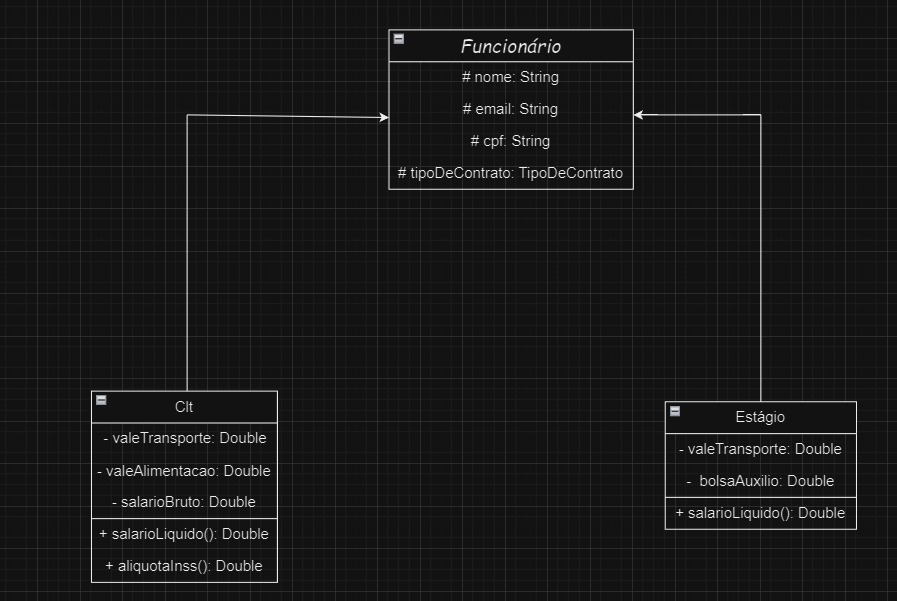

# Gestão RH

### Sistema com objetivo de gerenciar funcionários de uma empresa

### Funcionalidades
- Cadastro de funcionário
- Obter funcionários
- Obter funcionário especifíco
- Obter funcionários em ordem alfabética
- Atualização de funcionário
- Exclusão de funcionário
- Obter dados completos do funcionário

